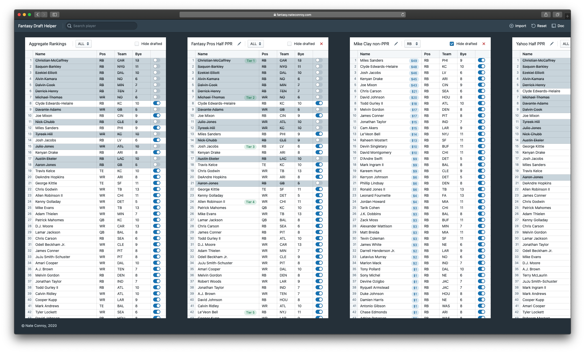

# [Fantasy Draft Helper](https://www.fantasy.nateconroy.com)

Simple assistant for compiling your rankings and managing your offline fantasy football draft.

Hosted at www.fantasy.nateconroy.com



## Usage

* Import CSV ranking list files (overall or by postition). 
* View them side by side in table format, as well as the generated aggregate rankings calculated by taking the average ranking of each player across each of your imported lists. 
* Search and select, or click to toggle any player's draft availability. This will propagate to each of the lists.
* Reset to clear the boards and mark all players as available after completing a draft, and draft again.
* Imported rankings and player availability are persisted in local storage, so you can navigate away and come back.

## Ranking List Requirements

Imported ranking lists must be in CSV format. The following column headers are recognized by the tool. 
They can appear in any order and additional columns are ignored.

* name (required) - the name of the player
* pos (required) - the position of the player (RB, WR, TE, QB, K, DST)
* team (required) - the team of the player
* bye (optional) - player bye week

## Development

Clone the repo

```bash
$ git clone https://github.com/NateConroy1/fantasy-draft-helper.git
```

Go to the project directory and install dependencies

```bash
$ cd fantasy-draft-helper && npm install
```

Build a dev version
```bash 
$ gatsby develop
```

Build a production version

```bash
$ gatsby build
$ gatsby serve
```
